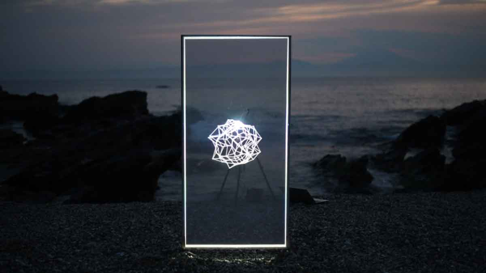
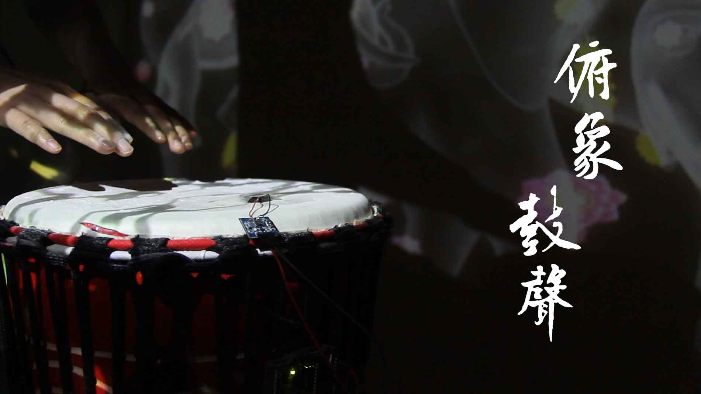

<!DOCTYPE HTML>
<!--
	Dimension by HTML5 UP
	html5up.net | @ajlkn
	Free for personal and commercial use under the CCA 3.0 license (html5up.net/license)
-->
<html>
	<head>
		<title>Dimension by HTML5 UP</title>
		<meta charset="utf-8" />
		<meta name="viewport" content="width=device-width, initial-scale=1, user-scalable=no" />
		<link rel="stylesheet" href="assets/css/main.css" />
		<noscript><link rel="stylesheet" href="assets/css/noscript.css" /></noscript>
	</head>
	<body class="is-preload">

		<!-- Wrapper -->
			

				<!-- Header -->
					<header id="header">
						

							
						

						

							

								<h1>PENGCHENG DU'S MEDIA WORKS</h1>
								
杜鹏程的新媒体艺术作品展示 <a href="https://www.behance.net/dupengchen1018">BEHANCE</a> # INTERVIEWS  
								pengcheng du's media works  
								“線” “橋” “卍” “ზ” “⊙”“अर्हत्” “#” “塵”“泡”

							

						

						<nav>
							<ul>
								<li><a href="#intro">Intro</a></li>
								<li><a href="#work">Work</a></li>
								<li><a href="#about">About</a></li>
								<li><a href="#contact">Contact</a></li>
								<!--<li><a href="#elements">Elements</a></li>-->
							</ul>
						</nav>
					</header>

				<!-- Main -->
					

						<!-- Intro -->
							<article id="intro">
								<h2 class="major">Intro</h2>
								
								
杜鹏程来自中国湖北省武汉市，在东京工艺大学研究生院学习数字媒体，并以专业前5%的3.89GPA的成绩硕士学位毕业.
								他的祖父和祖母都信奉佛教，所以他从小就对佛教很感兴趣，到目前为止他创作的很多作品都与佛教有关。  

								
经历和荣誉  
								东京工艺大学同窗会艺术学研究科奖学金  
								文部科学省外国人留学生学習奨励費  
								《数字媒体艺术的创作与教育》MANA全球高校交流系列活动主策划兼主持人  
								中国高校数字艺术大赛-彩焕南云探索计划 铜奖、创意奖、佳作奖  
								2021第六届“汇创青春”上海大学生国际赛新媒体艺术分赛 最佳创意金奖  
								2021 I CUBE 影魔方网龙沉浸光影大赛 闪光奖  
								

								
Du Pengcheng is from Wuhan, Hubei Province, China. He studied digital media at the Tokyo Polytechnic University graduate school and graduated with a master's degree. He decided to go to Japan to study new media art. My grandfather and grandmother were both Buddhists, so they were interested in Buddhism from an early age, and a lot of their work so far has been about Buddhism.  

								
Experiences  
								Tokyo Polytechnic University Scholarship (2021)  
								Ministry of Education, Culture, Sports, Science and Technology fees for foreign students (2022)  
								"Digital media art creation and education" Mana Global University Exchange series, master planner and moderator, planning  
								Chinese Universities Digital Interactive ART Awards Bronze Award. Creative Award. Best Work Award  
								2021 the 6th "Huichuang Youth" Shanghai University students cultural and creative works exhibition, international competition new media art sub-competition Best Creative Gold Award  
								2021 I CUBE IMMERSIVE EXPERIENCE COMPETITION Wow Award  
								By the way, check out my <a href="#work">awesome work</a>.

							</article>

						<!-- Work -->
							<article id="work">
								<h2 class="major">Work</h2>
								
								
TANK#1183  

								
Live Performance  
								VVVV W960.0 x H1920.0 x D∅ pix (each)  
								Dupengcheng  
								  
								  <a href="https://www.manamana.net/video/detail?id=1612089#!zh">Click here to see more in Mana.</a>   
								Who knows what will be in the 1183 tank.
								In order to store Fukushima nuclear waste water, Tokyo Electric Power has prepared a total of about 1,182 water storage tanks. In the past ten years, nearly 90% of water storage tanks have been filled.
								After a long discussion, we decided to try to make such a work in collaboration with the sea.
								We went to the Miura Peninsula, which is the most open sea in Tokyo, and walked through the castle island that has been corroded by sea water for a hundred years.
								We stored the information we collected and stored it in the 1183 tank made by ourselves.
								Through the production of this work, we want to bring ocean issues back to the table again.
								Use real-time data mapping and hand it to the sea to complete this work, and the sea will decide what should be in the 1183th tank.  
								We want to show the power of the sea naked before the eyes of the world.
								We also hope that people will put aside their arguments and make common changes to the marine environment.  
								To express our doubts about nuclear waste water  
								Concerns about the human living environment and the integration and resistance of humans to the natural environment  

								
为了储存福岛核废水，东京电力一共准备了约1182个储水罐.而这十年来，将近九成的储水罐已经被装满.
								经过长久的讨论，我们决定尝试着与大海联手制作一份这样的作品。  
								我们去到东京最靠外海的三浦半岛，走过被海水腐蚀过百年的城之岛.  
								我们将我们收集到的信息储存起来，存在了这第1183个我们自己制作的储蓄罐里.
								通过这次作品制作，我们想重新让海洋问题回归台面.
								利用实时数据mapping，交给大海来完成这个作品，由大海来决定第1183个储蓄罐里应该是什么.  
								我们想把大海的力量,赤裸裸的展现在世人的眼前.  
								我们也希望人们放下争论,为海洋环境做出共同的改变.  
								 <a href="https://www.manamana.net/video/detail?id=1612089#!zh">作品视频-Mana.</a>   

								
								
 <a href="https://www.manamana.net/video/detail?id=1783370#!zh">家に帰りみち·The way home</a> 

								
Live  Perfomance，Lidar，  
								Unity W1920x H10800.0 x D∅ pix (each) BibcamVfx
								dupengcheng

								
 <a href="https://vimeo.com/manage/videos/666378743">Click here to see more in VIMEO.</a>   
								Tokyo, Sugimoto-san, Nishiogi-kita/nDocumenting my last year of study in Japan, spending my graduate years in the midst of the epidemic.

								 
东京都杉并区西荻北，
								记录我在日本的留学生活的最后一年，在疫情中度过我的研究生时光.  
								<a href="https://www.manamana.net/video/detail?id=1783370#!zh">作品视频MANA.</a>   
								<a href="https://vimeo.com/manage/videos/666378743">作品视频VIMEO.</a> 

								
								
 <a href="https://www.manamana.net/video/detail?id=1957080#!zh">夜露時苦YOROSHIKU</a> 

								
Live  Perfomance，Lidar，  
								Unity W1920x H10800.0 x D∅ pix (each) BibcamVfx
								dupengcheng

								
 <a href="https://vimeo.com/manage/videos/666378743">Click here to see more in VIMEO.</a>   
								Tokyo, Sugimoto-san, Nishiogi-kita/nDocumenting my last year of study in Japan, spending my graduate years in the midst of the epidemic.

								 

								本次作品的创作灵感来源于重庆的街道和魔幻山城的雨后美感。运用光的线条来勾勒出大楼的轮廓线，流光绘影的光斑和多彩斑斓的数字艺术视觉效果来表现魔幻山城淅淅沥沥的雨后美感。在视觉效果中融合了山城的烟雾飘渺的朦胧感，用粒子系统和物理算法烟雾的效果表达了流光幻彩的未来城市的视觉效果。 
								 团队名称：夜露時苦YOROSHIKU  
								 团队成员名单：（排名不分先后）  
								 视觉：平野理子Hirano Riko、鲁亦然Yiran Lu ，姜齐Qi Jiang，杜鹏程Pengcheng Du  
								 音乐：AndyBear，何治宇Zhiyu He  
								 夜露時苦来自日本东京的创意团队，他们大部分都有日本的教育经历。  
								 杜鹏程：新媒体艺术家，视觉艺术家，创意编程教育者。东京工艺大学交互媒体硕士毕业。 获得过东京工艺大学同窗会艺术学研究科奖学金，日本文部科学省外国人留学生学習奨励費，中国高校数字艺术大赛-彩焕南云探索计划 铜奖、创意奖、佳作奖，2021第六届“汇创青春”上海大学生国际赛新媒体艺术分赛 最佳创意金奖，2021 I CUBE 影魔方网龙沉浸光影大赛 闪光奖。曾担任《数字媒体艺术的创作与教育》MANA全球高校交流系列活动主策划兼主持人。  
								 何治宇：独立音乐制作人/吉他手  
								 AndyBear：电音制作人，DJ，美国亚利桑那州立大学（ASU）流行音乐专业在读。美国AERO，FRQNCY等电音厂牌合作艺人。  
								 鲁亦然：新媒体艺术创作人，京都工艺纤维大学研修生，目前就读于澳门科技大学互动媒体艺术研究生（M1）。 曾获中国高校数字艺术大赛-彩焕南云探索计划 铜奖、佳作奖  
								 姜琦（JIANG QI），京都工艺纤维大学 设计学在读博士（D3），主要研究方向是新媒体艺术，观察数字艺术与社会的连接，探索艺术与人产生的更多的可能性。获得2020年艺术类人才培养特别项目；日本文部科学省外国人留学生学習奨励費。 
								<a href="https://www.manamana.net/video/detail?id=1957080#!zh">作品视频MANA.</a>   
								
								
The ARHAT in AI`s eyes  

								
Live  Perfomance,Web Camera,picture  
								Processing W960.0 x H1920.0 x D∅ pix (each)  
								Dupengcheng 2020  
								  
								 <iframe src="//player.bilibili.com/player.html?bvid=BV1Lr4y1g728&page=1" scrolling="no" border="0" frameborder="no" framespacing="0" allowfullscreen="true" style="width: 640px; height: 430px; max-width: 100%"> </iframe>
								  <a href="https://www.behance.net/gallery/128638147/the-ARHAT-in-AIs-eyes">Click here to see more in Behance.</a>   
								 <a href="https://www.behance.net/gallery/128638147/the-ARHAT-in-AIs-eyes">作品视频-BEHANCE.</a>   

								
								
俯象鼓声/The Elephant Drums  

								
Live Performance,VVVV,Arduino  
								VVVV W1920.0*3 x H1080.0*3 pix (each)  
								Dupengcheng  
								  
								  <a href="https://www.behance.net/gallery/128639111/The-Elephant-Drums">Click here to see more in Bhance.</a>   
								As young people head for the big cities, fewer dai festivals have been held in recent years, and there are few more foot-drumming performances than before. The work uses the sound data of elephant-foot drums to create the Dai’s signature patterns, abstracting the fabled scene where birds dance to the sound of elephant-foot drums and peacocks dance up and down.  
								With an Arduino
								The Arduino picks up data from four acceleration electronics that sense the hand’s motion as the performer taps on the drum. The faster the beat, the more feedback Arduino gets.
								In addition, a sound-sensing device is set on the side or bottom of the drum to recognize the sound of a foot-like drum. When the drum is struck, the sound sensor reads the value of the sound and transmits it to the Arduino.  
								Data transmission
								VVVVV is a hybrid visual/text real-time programming tool suite designed to handle large media environments through physical interfaces, real-time motion graphics, audio and video (which can interact with many users simultaneously) . The value of the Arduino can be read by uploading the Arduino’s sketch of Firmata and then using the VVVVV’s digital read (Firmata) and alo read (Firmata) . Digital write (Firmata) , AnalogWrite (Firmata) or ServoWrite (Firmata) a node connected to an Arduino pin sets the board’s data to control the Arduino board.  
								Visual effects
								The model of birds and peacocks is made by 3D software blender, and the model is imported into VVVV. According to the two different data obtained from the sound sensor and the acceleration electronic component, the visual effect of the percussion elephant-foot drum is realized to realize the sound visualization. In VVV, the control model can be achieved by processing the data of the voice.

								
隨著年輕人都去了大都市，近年來雲南少數民族的傣族的民族節日舉辦的越來越少，已經很少能夠看到和以前一樣的有象腳鼓伴奏的歌舞表演。這個作品使用象腳鼓的聲音數據來生成具有傣族標誌性的圖案，將傳說中【敲響象腳鼓時，百鳥聞聲起舞，孔雀也會隨著上下起舞】的場景抽象的表現出來。  
								用Arduino來完成
								由4個加速度電子元件來感應手的動作，當表演者用手敲擊鼓的時候，Arduino會從加速度電子元件讀取數據。當敲擊的節奏越快時，Arduino得到的反饋就會越多。
								除此之外，在鼓的側面或者底部會設置一個聲音感應裝置，用來識別象腳鼓的聲音。當鼓被敲響時，聲音感應裝置會讀取出聲音的數值，傳輸給Arduino數據。  
								數據的傳輸
								VVVV是一種混合的視覺/文本實時編程工具套件，旨在通過物理界面，實時運動圖形，音頻和視頻（可同時與許多用戶進行交互）來處理大型媒體環境。通過上傳Arduino的Firmata草圖，然後使用VVVV的DigitalRead（Firmata）和AnalogRead（Firmata）即可讀取Arduino的數值。DigitalWrite（Firmata），AnalogWrite（Firmata）或ServoWrite（Firmata）節點連接Arduino的引腳就可以設置開發板的數據來控製Arduino開發板。  
								視覺效果的製作
								利用3d軟件blender製作鳥類和孔雀的模型，將模型導入VVVV，根據聲音傳感器和加速度電子元件獲得的兩種不同的數據來實現敲擊象腳鼓來實現聲音可視化的視覺效果。在VVVV中可以處理聲音的數據達到控製模型的作用。  
								 <a href="https://www.manamana.net/video/detail?id=1494945#!zh">作品视频-Mana.</a>   

								
								
The ARHAT in AI`s eyes  

								
Live  Perfomance,Web Camera,picture  
								Processing W1280 x H960.0pix  
								Dupengcheng  
								  
								  <a href="https://www.manamana.net/video/detail?id=1612089#!zh">Click here to see more in Mana.</a>   
								import processing.video.*;
								Movie movie;
								boolean playing;
								float scale=2.0;

								void setup() {  
								size(1680,1050,P3D);  
								frameRate(60);  
								noStroke();  
								movie = new Movie(this,”test.MOV”);  
								movie.loop();  
								playing=true;  
								}  

								void draw(){  
								background(0);  
								strokeWeight(5.0);  
								float hStep=6.0;  
								float wStep=6.0;  
								for(float j=0; j<height;j+=hStep) {  
								beginShape();  
								for(float i=0;i<width;i+=wStep){  
								color col=movie.get(int(i),int(j));  
								float br=brightness(col);  
								stroke(col);  
								vertex(i,j,br*scale);  
								}  
								endShape();  
								}  
								}  
								void movieEvent(Movie m) {  
								m.read();  
								}  
								  <a href="https://www.behance.net/gallery/128638147/the-ARHAT-in-AIs-eyes">Click here to see more in Bhance.</a>   

								
								
法身萬象SDF/The dharma body is full of things SDF  

								
Yunnan has always been a region where many ethnic minorities live in compact communities.
								Since Dali, Yunnan has been surrounded by Buddhist countries. Inland Buddhism can enter Yunnan from Chengdu or Jiaozhi,
								then through Indochina and South Asian countries to link up with Buddhism: Tibet Buddhism is directly into the western Yunnan, but also to communicate with Nepal, India, Buddhism links.
								I have been to Xishuangbanna General Buddhist temple site to experience the ruins of the Buddhist temple. When you see the magnificent buildings and statues of Buddha, your heart is filled with emotion
								The main purpose of this work is to use new media,/nthe Buddhist culture of Jinghong in a way that has never been seen before.
								I explored what this form of art would look like when it merged with ancient Buddhism.
								In this work, the elusive Buddha is at the center of the viewer’s vision. And it has no fixed shape.
								Using projection and screen as media, this work expresses the concepts of illusion and reality in Buddhism in the form of new media art.  
								云南历来是我国多种少数民族聚居的地区，原始宗教普遍流行，又各呈异态。
								从大理开始，云南就处在佛教国家的包围中。内地佛教可以从成都或交趾进入云南，
								然后经中南半岛同南亚诸国的佛教衔接起来：吐蕃佛教则直接进入云南西陲，又能沟通与尼泊尔、印度佛教的联系。　
								我曾到西双版纳总佛寺实地感受佛寺圣地遗迹。当看到宏伟壮观的建筑和佛像时，心中充满感动。
								这个作品的主要目的是运用新的媒体手段，将位于景洪地区的佛教文化以前所未有的形式表现出来。  
								在现代社会，新媒体艺术作为现代艺术和现代艺术的最前沿艺术形式，
								通过音响、光学、电子技术、数字技术和互联网技术等方式进行创造活动。
								我们探讨了这种艺术形式与古老的佛教相融合时会有什么样的表现形式。
								在此作品中，变幻莫测的佛像处于观看者视线的中心。并且没有固定的形状。
								当今科技飞速发展，各种各样的信息充斥在周围，人们很难知道该选择哪些信息。
								此作品以投影映射和屏幕作为媒介，以新媒体艺术的形式表达了佛教中虚妄与实相的概念。  
								凡所有相，皆是虚妄。若见诸相非相，即见如来。”  
								《金刚经》-第十四品 离相寂灭分  
								<a href="https://www.manamana.net/video/detail?id=1496360#!zh">作品视频-Mana.</a>   
								<a href="https://www.behance.net/gallery/128636207/SDF-buddaha">Click here to see more in Bhance.</a> 

							</article>

						<!-- About -->
							<article id="about">
								<h2 class="major">About</h2>
								
								
Lorem ipsum dolor sit amet, consectetur et adipiscing elit. Praesent eleifend dignissim arcu, at eleifend sapien imperdiet ac. Aliquam erat volutpat. Praesent urna nisi, fringila lorem et vehicula lacinia quam. Integer sollicitudin mauris nec lorem luctus ultrices. Aliquam libero et malesuada fames ac ante ipsum primis in faucibus. Cras viverra ligula sit amet ex mollis mattis lorem ipsum dolor sit amet.

							</article>

						<!-- Contact -->
							<article id="contact">
								<h2 class="major">Contact</h2>
								<form method="post" action="#">
									

										

											<label for="name">Name</label>
											<input type="text" name="name" id="name" />
										

										

											<label for="email">Email</label>
											<input type="text" name="email" id="email" />
										

										

											<label for="message">Message</label>
											<textarea name="message" id="message" rows="4"></textarea>
										

									

									<ul class="actions">
										<li><input type="submit" value="Send Message" class="primary" /></li>
										<li><input type="reset" value="Reset" /></li>
									</ul>
								</form>
								<ul class="icons">
									<li><a href="#" class="icon brands fa-twitter">Twitter</a></li>
									<li><a href="#" class="icon brands fa-facebook-f">Facebook</a></li>
									<li><a href="#" class="icon brands fa-instagram">Instagram</a></li>
									<li><a href="#" class="icon brands fa-github">GitHub</a></li>
								</ul>
							</article>

						<!-- Elements -->
							<article id="elements">
								<h2 class="major">Elements</h2>

								<section>
									<h3 class="major">Text</h3>
									
This is <b>bold</b> and this is <strong>strong</strong>. This is <i>italic</i> and this is <em>emphasized</em>.
									This is superscript text and this is subscript text.
									This is <u>underlined</u> and this is code: <code>for (;;) { ... }</code>. Finally, <a href="#">this is a link</a>.

									

									<h2>Heading Level 2</h2>
									<h3>Heading Level 3</h3>
									<h4>Heading Level 4</h4>
									<h5>Heading Level 5</h5>
									<h6>Heading Level 6</h6>
									

									<h4>Blockquote</h4>
									<blockquote>Fringilla nisl. Donec accumsan interdum nisi, quis tincidunt felis sagittis eget tempus euismod. Vestibulum ante ipsum primis in faucibus vestibulum. Blandit adipiscing eu felis iaculis volutpat ac adipiscing accumsan faucibus. Vestibulum ante ipsum primis in faucibus lorem ipsum dolor sit amet nullam adipiscing eu felis.</blockquote>
									<h4>Preformatted</h4>
									<pre><code>i = 0;

while (!deck.isInOrder()) {
    print 'Iteration ' + i;
    deck.shuffle();
    i++;
}

print 'It took ' + i + ' iterations to sort the deck.';</code></pre>
								</section>

								<section>
									<h3 class="major">Lists</h3>

									<h4>Unordered</h4>
									<ul>
										<li>Dolor pulvinar etiam.</li>
										<li>Sagittis adipiscing.</li>
										<li>Felis enim feugiat.</li>
									</ul>

									<h4>Alternate</h4>
									<ul class="alt">
										<li>Dolor pulvinar etiam.</li>
										<li>Sagittis adipiscing.</li>
										<li>Felis enim feugiat.</li>
									</ul>

									<h4>Ordered</h4>
									<ol>
										<li>Dolor pulvinar etiam.</li>
										<li>Etiam vel felis viverra.</li>
										<li>Felis enim feugiat.</li>
										<li>Dolor pulvinar etiam.</li>
										<li>Etiam vel felis lorem.</li>
										<li>Felis enim et feugiat.</li>
									</ol>
									<h4>Icons</h4>
									<ul class="icons">
										<li><a href="#" class="icon brands fa-twitter">Twitter</a></li>
										<li><a href="#" class="icon brands fa-facebook-f">Facebook</a></li>
										<li><a href="#" class="icon brands fa-instagram">Instagram</a></li>
										<li><a href="#" class="icon brands fa-github">Github</a></li>
									</ul>

									<h4>Actions</h4>
									<ul class="actions">
										<li><a href="#" class="button primary">Default</a></li>
										<li><a href="#" class="button">Default</a></li>
									</ul>
									<ul class="actions stacked">
										<li><a href="#" class="button primary">Default</a></li>
										<li><a href="#" class="button">Default</a></li>
									</ul>
								</section>

								<section>
									<h3 class="major">Table</h3>
									<h4>Default</h4>
									

										<table>
											<thead>
												<tr>
													<th>Name</th>
													<th>Description</th>
													<th>Price</th>
												</tr>
											</thead>
											<tbody>
												<tr>
													<td>Item One</td>
													<td>Ante turpis integer aliquet porttitor.</td>
													<td>29.99</td>
												</tr>
												<tr>
													<td>Item Two</td>
													<td>Vis ac commodo adipiscing arcu aliquet.</td>
													<td>19.99</td>
												</tr>
												<tr>
													<td>Item Three</td>
													<td> Morbi faucibus arcu accumsan lorem.</td>
													<td>29.99</td>
												</tr>
												<tr>
													<td>Item Four</td>
													<td>Vitae integer tempus condimentum.</td>
													<td>19.99</td>
												</tr>
												<tr>
													<td>Item Five</td>
													<td>Ante turpis integer aliquet porttitor.</td>
													<td>29.99</td>
												</tr>
											</tbody>
											<tfoot>
												<tr>
													<td colspan="2"></td>
													<td>100.00</td>
												</tr>
											</tfoot>
										</table>
									

									<h4>Alternate</h4>
									

										<table class="alt">
											<thead>
												<tr>
													<th>Name</th>
													<th>Description</th>
													<th>Price</th>
												</tr>
											</thead>
											<tbody>
												<tr>
													<td>Item One</td>
													<td>Ante turpis integer aliquet porttitor.</td>
													<td>29.99</td>
												</tr>
												<tr>
													<td>Item Two</td>
													<td>Vis ac commodo adipiscing arcu aliquet.</td>
													<td>19.99</td>
												</tr>
												<tr>
													<td>Item Three</td>
													<td> Morbi faucibus arcu accumsan lorem.</td>
													<td>29.99</td>
												</tr>
												<tr>
													<td>Item Four</td>
													<td>Vitae integer tempus condimentum.</td>
													<td>19.99</td>
												</tr>
												<tr>
													<td>Item Five</td>
													<td>Ante turpis integer aliquet porttitor.</td>
													<td>29.99</td>
												</tr>
											</tbody>
											<tfoot>
												<tr>
													<td colspan="2"></td>
													<td>100.00</td>
												</tr>
											</tfoot>
										</table>
									

								</section>

								<section>
									<h3 class="major">Buttons</h3>
									<ul class="actions">
										<li><a href="#" class="button primary">Primary</a></li>
										<li><a href="#" class="button">Default</a></li>
									</ul>
									<ul class="actions">
										<li><a href="#" class="button">Default</a></li>
										<li><a href="#" class="button small">Small</a></li>
									</ul>
									<ul class="actions">
										<li><a href="#" class="button primary icon solid fa-download">Icon</a></li>
										<li><a href="#" class="button icon solid fa-download">Icon</a></li>
									</ul>
									<ul class="actions">
										<li>Disabled</li>
										<li>Disabled</li>
									</ul>
								</section>

								<section>
									<h3 class="major">Form</h3>
									<form method="post" action="#">
										

											

												<label for="demo-name">Name</label>
												<input type="text" name="demo-name" id="demo-name" value="" placeholder="Jane Doe" />
											

											

												<label for="demo-email">Email</label>
												<input type="email" name="demo-email" id="demo-email" value="" placeholder="jane@untitled.tld" />
											

											

												<label for="demo-category">Category</label>
												<select name="demo-category" id="demo-category">
													<option value="">-</option>
													<option value="1">Manufacturing</option>
													<option value="1">Shipping</option>
													<option value="1">Administration</option>
													<option value="1">Human Resources</option>
												</select>
											

											

												<input type="radio" id="demo-priority-low" name="demo-priority" checked>
												<label for="demo-priority-low">Low</label>
											

											

												<input type="radio" id="demo-priority-high" name="demo-priority">
												<label for="demo-priority-high">High</label>
											

											

												<input type="checkbox" id="demo-copy" name="demo-copy">
												<label for="demo-copy">Email me a copy</label>
											

											

												<input type="checkbox" id="demo-human" name="demo-human" checked>
												<label for="demo-human">Not a robot</label>
											

											

												<label for="demo-message">Message</label>
												<textarea name="demo-message" id="demo-message" placeholder="Enter your message" rows="6"></textarea>
											

										

										<ul class="actions">
											<li><input type="submit" value="Send Message" class="primary" /></li>
											<li><input type="reset" value="Reset" /></li>
										</ul>
									</form>
								</section>

							</article>

					

				<!-- Footer -->
					<footer id="footer">
						
&copy; the dharma body is full of things by dupengcheng 2021.

					</footer>

			

		<!-- BG -->
			

		<!-- Scripts -->
			
			
			
			
			

	</body>
</html>
